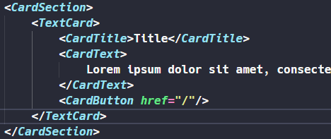
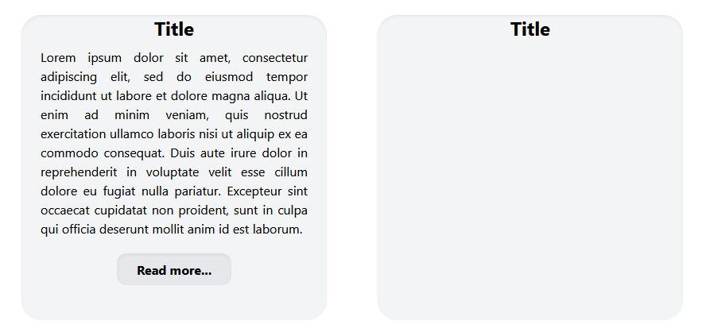

# tailwind-card

*To use this package, first install [TailwindCSS](tailwindcss.com) on a [React](reactjs.org) or [Next](nextjs.org) project. You can also use my [Next Tailwind Template](https://github.com/Soetch/tailwind-template).*

A basic usage of this package is :

## CardSection
Creates a 2-row card emplacement.
## CardTitle
Takes a Title parameter (string).
## TextCard
Creates a Card parent.
## CardText
Takes a Text parameter (string).
## CardButton
Creates a "Read More" button. Take an href parameter.

# Don't hesitate to modify the code. This is my template, our tastes aren't the same. I made it so it can adapt to every sort of Tailwind changes on its code.